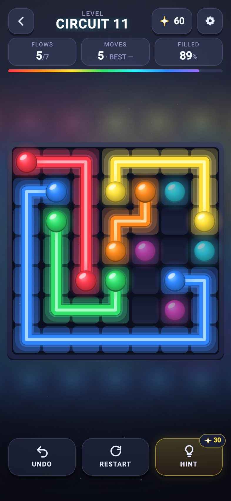
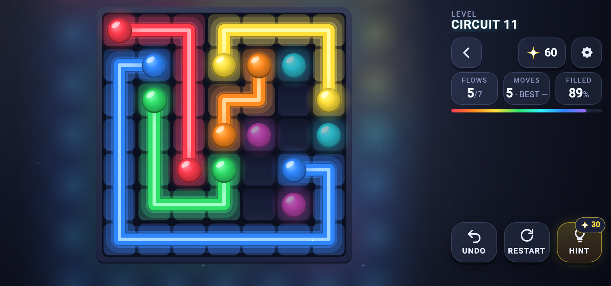

# FLOW CONNECT

A neon path-drawing logic puzzle for RUN.world. Connect every pair of matching
colours and fill every cell — tubes can't cross. Every board has exactly one
answer.

<p align="center">
  
</p>

<p align="center">
  
</p>

Built on the LEADLIGHT foundation (RUN SDK 5.28, PixiJS 8 WebGPU-first with
WebGL fallback, React shell). Every texture, backdrop, level thumbnail, store
tile, and sound is generated by the game's own code — **no image, font, or
audio file ships**.

**[`DESIGN.md`](DESIGN.md) is canon** for rules, levels, rewards, economy, and
monetization.

## What's in it

- **125 hand-curated generated levels** in five packs (5×5 → 9×9), every one
  proven to have exactly one solution, ordered by difficulty.
- **Daily Flow** — one shared board per day, with a streak.
- Undo, restart, hints (sparks or a rewarded video), perfect ratings, best-move
  records, level thumbnails that fill in with your own solutions.
- Six tube sets (three earnable, three via Run Bits), daily sparks, daily jobs,
  return reminders, stats, three languages.

## Status

Ship-track, not yet deployed. **`gameId` is a placeholder** in
`src/config/platform.ts` and `game.config.prod.json` — run `rundot init` to
provision Flow Connect's own id before any deploy. (The LEADLIGHT id this was
built from has been removed so a deploy can never overwrite that game.)

## Running it

```bash
npm install
npm run dev            # http://localhost:5187
npm run dev:playground # opt-in RUN Playground (real, persistent purchases)
```

| Query | Effect |
| --- | --- |
| `?screen=<id>` | `main`, `levels`, `studio`, `daily-rewards`, `daily-quests`, `stats`, `settings`, or `game` |
| `&level=circuit:4` / `&level=daily` | With `screen=game`: a specific pack level (zero-based) or today's Daily Flow |
| `?debug=1` | Diagnostics panel |
| `?qa=1` | The `__gameQa` browser contract used by `visual-qa.mjs` |
| `?renderer=webgpu\|webgl` | Force a backend, strictly |

## Verifying it

```bash
npm run check       # format, lint, tests, public audit, both production builds
npm run simulate    # every shipped level unique + playable; drag/cut/undo/hint rules; Daily Flow; rewards
npm run balance     # the spark economy against the hint price
npm run visual-qa   # four viewports, real drags that solve real boards (GPU-heavy)
npm run levels      # regenerate src/game/flow/levels.json (changes every level!)
npm run thumbnail   # re-render public/thumbnail.jpg from the game's own art
npm run screenshots # re-capture the README images from the running game
```

## Layout

```
src/game/flow/      the rules — FlowGame, solver, generator, level packs, rewards.
                    Renderer-free. This is what `npm run simulate` runs.
src/game/art/       every drawing function, as Canvas2D (neon.ts is the generator).
src/game/scene/     the board scene, layout, effects, ambient light.
src/game/           the React↔Pixi boundary and the level controller that owns
                    the consequences (sparks, hints, ads, analytics, save).
src/systems/        save, tube sets, commerce, ads, monetization, daily systems.
src/ui/             the React shell: menu, levels, HUD, Studio, settings.
legacy/             the original Phaser version, kept for reference only.
```

Two boundaries are load-bearing:

- **`FlowGame` owns legality; `FlowScene` owns presentation.** The scene never
  decides whether a drag is legal — it asks.
- **Ownership is never read from the save.** Bought tube sets come from RUN
  Entitlements every session.

## Notes for anyone changing this

- Browser storage (`localStorage` etc.) is unavailable in the RUN iframe and the
  SDK build rejects it. Use appStorage (see `src/sdk/kvMirror.ts` for small
  synchronous values).
- Never add `Math.random()`; use `src/game/noiseRandom.ts`.
- Renderer creation/teardown goes only through `src/rendering/rendererLifecycle.ts`.
- The portrait HUD/action-bar reserves and the landscape rail width are mirrored
  between `scene/layout.ts` and `app.css`. Change one, change the other.
- Changing the generator reshuffles every level; saved progress is keyed by
  pack and index, so bump the level catalogue version deliberately.
